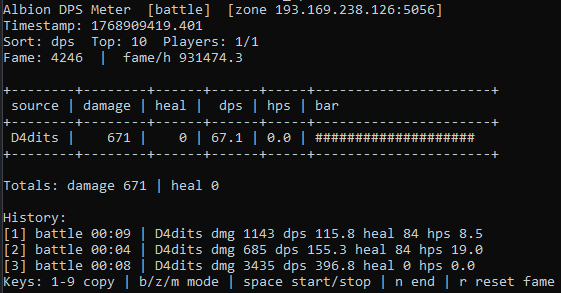

# Albion DPS Meter (CLI)

Passive DPS/HPS meter for Albion Online (CLI-only).
It reads UDP traffic only (PCAP replay or live capture); no client hooks, overlays, or modifications.

Core safety rule: the meter aggregates only the local player and party members (never unrelated nearby players).

<p align="center">
  
</p>

<p align="center">
  
  
  
</p>

---

## ☕ Support the project

If this project helps you and you'd like to support further development,
you can buy me a coffee:

[](https://buycoffee.to/ao-dps/)

Every contribution helps — thank you! ❤️

## Quickstart (Windows / PowerShell)
1) Create and activate a virtualenv:
```
python -m venv venv
.\venv\Scripts\Activate.ps1
```
2) Install this repo (editable) + live capture deps:
```
python -m pip install -U pip
python -m pip install -e ".[capture]"
```
3) Replay a PCAP (your capture or a shared fixture):
```
albion-dps replay .\path\to\file.pcap
```
4) Live capture:
```
albion-dps live
```

## Requirements
- Python 3.10+
- Replay mode: no extra dependencies
- Live capture:
  - Windows: Npcap installed (recommended: “WinPcap API-compatible mode”) + `pcapy-ng`
  - Linux: libpcap + `pcapy-ng`

## Install
Editable install (recommended for development):
```
python -m pip install -e .
```
Optional extras:
```
python -m pip install -e ".[capture]"
python -m pip install -e ".[test]"
```

If `albion-dps` is not recognized, you likely forgot to activate the venv or install the project.
See `docs/TROUBLESHOOTING.md`.

## Run
After installing (provides the `albion-dps` command):
```
albion-dps replay albion_dps/artifacts/pcaps/albion_combat_12_party.pcap
albion-dps live
```

Without installing (runs directly from the repo checkout):
```
python -m albion_dps replay albion_dps/artifacts/pcaps/albion_combat_12_party.pcap
python -m albion_dps live
```

Common flags:
```
--sort dmg|dps|heal|hps
--top N
--snapshot out.json
--debug
--self-name "YourName"
--self-id 123456
--mode battle|zone|manual
--history N
--battle-timeout 20
```
Environment defaults (optional):
```
$env:ALBION_DPS_SELF_NAME="YourName"
$env:ALBION_DPS_SELF_ID="123456"
```

## Modes (what “session” means)
- `battle` (default): creates a session when you enter combat state and ends it when you leave combat state.
  Fallback: if combat state isn’t observed, it can still end by `--battle-timeout` inactivity.
- `zone`: a long-running session per server endpoint (shown as `ip:port`), reset on zone change.
- `manual`: start/stop sessions yourself (TUI key: space).

## TUI keys
- `b` battle mode (default)
- `z` zone mode
- `m` manual mode (toggle; start/stop with space)
- `space` start/stop manual session
- `n` end current session (archive)
- `r` reset fame counters
- `1-9` copy the Nth history entry to clipboard

## Output and artifacts
- Unknown payloads: `artifacts/unknown/` (written always; log line only in `--debug`)
- Optional raw packet dumps: `artifacts/raw/` (use `--dump-raw artifacts/raw` or run live with `--debug`)
- Snapshot output: pass `--snapshot out.json` to write a JSON snapshot
- PCAP replay: pass any `.pcap` path (PCAPs are typically kept local and ignored by git)

## Live capture notes
List interfaces:
```
albion-dps live --list-interfaces
```
Specify interface:
```
albion-dps live --interface "<name>"
```
Advanced options:
```
--bpf "udp and (port 5055 or port 5056 or port 5058)"
--promisc
--snaplen 65535
--timeout-ms 1000
--dump-raw artifacts/raw
```
Note: `albion-dps live` auto-detects traffic; if no packets are seen yet, it falls back to the first non-loopback
interface. Start the game to generate traffic.

## Party-only filtering (important)
The meter aggregates only events from:
- the local player (“self”)
- party members (when present)

If self/party info isn’t observed yet, results can be empty. You can seed/override self using `--self-name` or `--self-id`.

## Project docs
- Architecture overview: `docs/ARCHITECTURE.md`
- Troubleshooting: `docs/TROUBLESHOOTING.md`
- Reverse-engineering workflow notes: `PROMPTS.md`

## Tests
Some integration tests use PCAP fixtures; if you don’t have them locally, those tests will be skipped.
```
python -m pip install -e ".[test]"
python -m pytest -q
```
